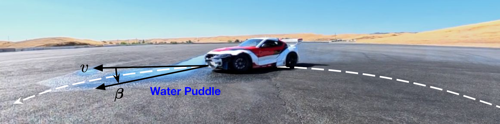
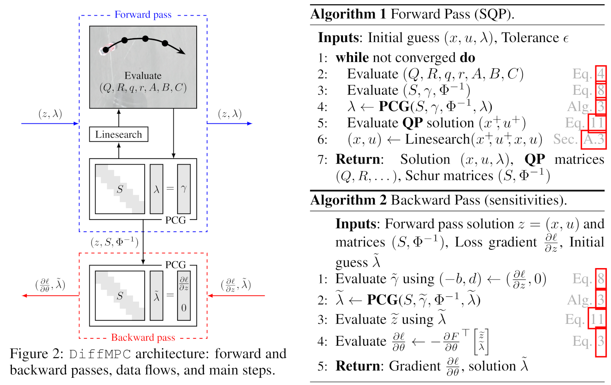

# diffmpc

Differentiable Model Predictive Control (MPC) on the GPU. 

This repository includes code to reproduce results in Section 4 of the manuscript "Differentiable Model Predictive Control on the GPU".

diffmpc can be used to tune MPC algorithms via reinforcement learning and domain randomization to enable robust performance. For example, diffmpc can be used to enable robust drifting through water puddles.


diffmpc uses sequential quadratic programming (SQP) and a custom preconditioned conjugate gradient (PCG) routine to exploit the problem's structure and enable efficient parallelization on the GPU.



## Installation

This code was tested with Python 3.10.12 on Ubuntu 22.04.5.

We recommend installing the package in a virtual environment. First, run
```bash
python -m venv ./venv
source venv/bin/activate
```
Upgrade pip and install all dependencies by running:
```bash
python -m pip install --upgrade pip
python -m pip install -r requirements.txt
```
Clone and update submodules:
```bash
git submodule update --init --recursive
```
The package can be installed by running
```bash
python -m pip install -e .
```
To enable CUDA support, you may need to install an extra. For cuda 12, this would be:
```bash
pip uninstall -y jax jaxlib
pip install --upgrade "jax[cuda12]"
```

## Examples
For examples on how to use diffmpc, refer to:

* RL spacecraft example: [RL_spacecraft.ipynb](notebooks/RL_spacecraft.ipynb)
* RL quadrotor example: [RL_quadrotor.ipynb](notebooks/RL_quadrotor.ipynb)

## Benchmarking
Scripts and instructions for rerunning benchmarks are in `benchmarking` ([see details here](benchmarking/README.md)).

## Testing
The following unit tests should pass:
```bash
python -m pytest tests
```
